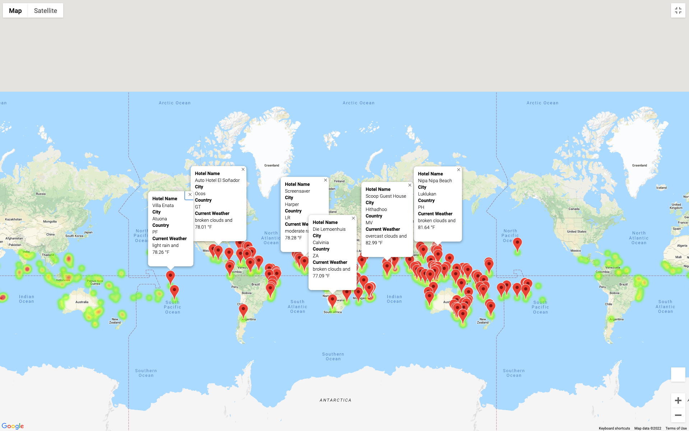
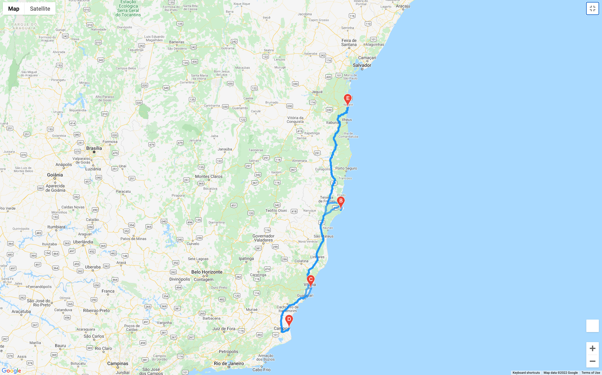
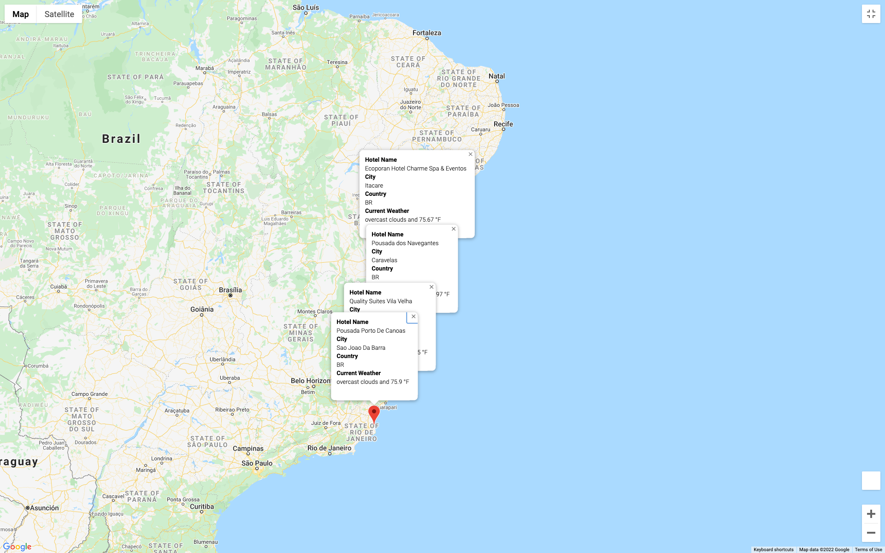

# World_Weather_Analysis

## Purpose
The purpose of this analysis is to collect and analyze weather data across cities worldwide and create a vacation map that allows users to apply weather criteria to identify potential travel destinations. 
By utilizing Google API's, we provide users with recommended hotels within there preferred travel destinations.

## Description
In order to create the vacation map, we generated a list of 1,500 random latitudes and longitudes. With the coordinates, we retrieved and compiled a list of the nearest cities using the citipy module. The data was pulled from OpenWeatherMap API. 
The resulting map provides users with descriptions of the destinations found on our list, including: hotel name, city, country, and current weather and description.

### Weather Database folder 
contains information from 740 countries that was retrieved with the OpenWeatherMap API. The weather information consists of maximum temperatire, humidity, cloudiness, wind speed, country, date, and weather description. The amount of information provided will allow app users to make an informed decision regarding their travel plans.

### Vacation Search folder 
contains data that was obtained via the weather database that was previoulsy created and uses the Google Maps API to plot potential travel locations based on the user's input for minimum and maximum temperature. 

### Vacation Itinerary folder

The Google Directions API was used to create a travel itinerary that shows the route between four cities chosen from the customer’s possible travel destinations.  

Then a marker layer map with pop-up markers for each city on the itinerary was created. This map show hotel name, city, country, weather description, and maximim temperature for the selected travel destinations along the route.

